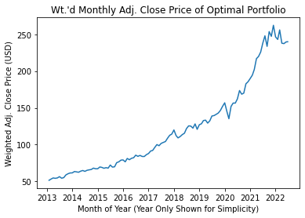
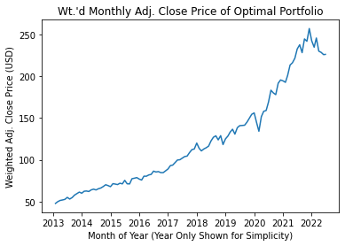
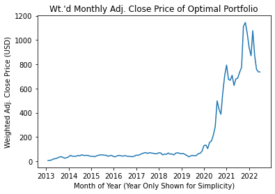
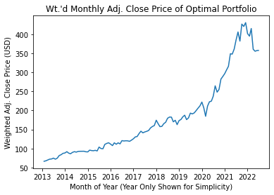
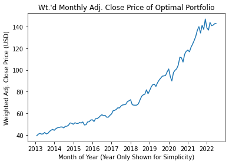

================
BAIBHAV PATHY
June 2023

-   <a href="#1-abstract" id="toc-1-abstract">1 Abstract</a>
-   <a href="#2-introduction" id="toc-2-introduction">2 Introduction</a>
-   <a href="#3-modeling" id="toc-3-modeling">3 Modeling</a>
    -   <a href="#31-model-formulation" id="toc-31-model-formulation">3.1 Model
        Formulation</a>
        -   <a href="#311-overview-of-model-formulation"
            id="toc-311-overview-of-model-formulation">3.1.1 Overview of Model
            Formulation</a>
        -   <a
            href="#312-minimizing-risk-of-portfolio-using-modern-portfolio-theory"
            id="toc-312-minimizing-risk-of-portfolio-using-modern-portfolio-theory">3.1.2
            Minimizing Risk of Portfolio using Modern Portfolio Theory</a>
        -   <a
            href="#313-solving-for-optimal-portfolio-using-particle-swarm-optimization-pso"
            id="toc-313-solving-for-optimal-portfolio-using-particle-swarm-optimization-pso">3.1.3
            Solving for Optimal Portfolio using Particle Swarm Optimization
            (PSO)</a>
    -   <a href="#32-model-solution" id="toc-32-model-solution">3.2 Model
        Solution</a>
        -   <a href="#321-base-solution-and-results"
            id="toc-321-base-solution-and-results">3.2.1 Base Solution and
            Results</a>
        -   <a href="#322-testing-algorithm-with-various-parameters"
            id="toc-322-testing-algorithm-with-various-parameters">3.2.2 Testing
            Algorithm with Various Parameters</a>
        -   <a href="#323-summary-of-model-solutions"
            id="toc-323-summary-of-model-solutions">3.2.3 Summary of Model
            Solutions</a>
-   <a href="#4-discussion-on-modeling-process"
    id="toc-4-discussion-on-modeling-process">4 Discussion on Modeling
    Process</a>
    -   <a href="#41-contribution-of-modeling"
        id="toc-41-contribution-of-modeling">4.1 Contribution of Modeling</a>
    -   <a href="#42-difficulties-encountered"
        id="toc-42-difficulties-encountered">4.2 Difficulties Encountered</a>
    -   <a href="#43-deviation-from-preliminary-objectives"
        id="toc-43-deviation-from-preliminary-objectives">4.3 Deviation from
        Preliminary Objectives</a>
-   <a href="#5-conclusion" id="toc-5-conclusion">5 Conclusion</a>
-   <a href="#6-references" id="toc-6-references">6 References</a>
    -   <a href="#61-code-references" id="toc-61-code-references">6.1 Code
        References</a>
    -   <a href="#62-literature-references"
        id="toc-62-literature-references">6.2 Literature References</a>

# 1 Abstract

This paper outlines how Modern Portfolio Theory can be implemented using
notable financial engineering techniques. The generated algorithm
discussed within this paper combines a dynamic implementation of Modern
Portfolio Theory with a robust metaheuristic solver to find the globally
minimum risk portfolio, given the desired set of stocks and sample date
range. Specifically, the metaheuristic called “Particle Swarm
Optimization” intends to overcome issues with local optima in non-linear
modeling. The model delivers the optimal weights to invest in a certain
set of stocks, defined by the user of the tool. Additionally, the model
displays key summary statistics like the risk and expected return of the
portfolio.

# 2 Introduction

Specifically, the project uses Python to pull monthly data for the `N`
number of stocks defined by the user, as well as the Treasury Bill rate
(as a proxy for the risk-free rate). The decision variables will be the
weights to invest in each stock that minimizes the risk of a
portfolio.  
Since the objective is to minimize the risk of the portfolio, this
method must account for within-stock variances as well cross-stock
covariances. The objective function becomes non-linear in parameters. To
solve this non-linear objective, the tool will use metaheuristic
techniques to search for the optimal portfolio. The algorithm uses the
particle swarm metaheuristic.

# 3 Modeling

## 3.1 Model Formulation

### 3.1.1 Overview of Model Formulation

Overall, this developed computer programming application in Python
accomplishes a direct application of financial engineering by
implementing Modern Portfolio Theory, while also improving the modeling
by leveraging the metaheuristic technique, Particle Swarm Optimization.
The modeling within this tool primarily relies on the use of Modern
Portfolio Theory, which Markowitz introduced in 1952, to minimize the
risk of a multi-stock portfolio while meeting an investor’s desired
return. To minimize the risk, or standard deviation of a portfolio, the
model must use a non-linear optimizer to solve for the optimal
allocation of weights in each stock; the tool makes use of a popular
metaheuristic technique called Particle Swarm Optimization (PSO), which
famously overcomes issues with local minima.

### 3.1.2 Minimizing Risk of Portfolio using Modern Portfolio Theory

The tool pulls stock data from Yahoo Finance, then implements Modern
Portfolio Theory to that data. Shortly, this method gives a
“statistical” way to “diversify” investments in a multiple stock
portfolio and not “put all their eggs in one basket” (Benninga 306).

#### 3.1.2.1 Importing Stocks using `yfinance` Package

  
Using the popular package called `yfinance`, the tool takes a list
parameter named `StockList` with publicly traded stock tickers to
evaluate when considering inclusion within the portfolio. Yahoo Finance
supplies detailed-historical data surrounding money market assets.
Although `yfinance` allows real-time data for each minute, the tool uses
monthly stock data with the adjusted close price of each stock.
Commonly, financiers use the adjusted close price for historical data.

This paper will refer to a parameter named `Periods`, which are the
monthly periods of a given stock in a sample date range. Please note
that the user of the program defines the date range to include within
the sample.

Lastly, the tool imports the previous, or most recent, adjusted close
price for the 3-month Treasury Bill (ticker `^IRX` as a proxy for the
risk-free rate), which is used when calculating the Sharpe ratio. See
later sections for the uses and definitions. Note that the risk-free
rate proxy will be referred to as the `riskFreeRate` in later
calculations.

#### 3.1.2.2 Returns of Each Stock

  
After importing the adjusted close price of each stock, the tool
calculates the percentage return of each month, for all stocks in the
`StockList` parameter, as well as months in all `Periods`. Note that
this calculation finds the percentage rate of return from the prior
period to the current period `t`. See the calculation of the return of
the stock below.

, \\ \forall \ stock \in StockList, \ \forall \ t \in Periods
\end{aligned}")

#### 3.1.2.3 Expected Returns of Each Stock

  
The program takes the arithmetic mean over for all periods to understand
what the expected rate of return of each stock is. Note that a known
limitation of Modern Portfolio Theory is that the use of expected
returns does not consider the future, which diminishes the potential for
predictive analytics; fitting the model to historical data will help
find optimality in hindsight, but may not work well for forward-looking
analysis (Benninga, 305). For example, imagine if an investor used stock
data from the COVID-19 pandemic shutdown months to optimize the
portfolio. Using this data assumes that the stocks in the sample perform
similarly outside of the COVID-19 pandemic. This assumption could have
bias; however, if the investor chose to investigate the bounds of
potential loss, a season like the shutdown months could provide a
platform for natural experiments. Additionally, the investor may ground
themselves in the Modern Portfolio Theory method if they forecast that
future months may perform similarly to the sample period. See the
calculation below for the expected return of each stock, where
`numPeriods` represents the number of months in the sample.

#### 3.1.2.4 Excess Return of Each Stock

  
The tool calculates the excess return of each stock for all periods to
discover how the return of a given period outperforms or underperforms
the expected return of the stock. Simply, the excess return is the
percentage return of a stock in excess of the stock’s expected, or mean,
return. See calculation below.

#### 3.1.2.5 Accounting for Covariances Among Stocks

  
To evaluate the risk, or portfolio sample standard deviation, we must
account for covariances among stocks. Conceptually, when accounting for
covariances among stocks, the investor can diversify “away” risk when
stock prices “move”, or co-vary, together, which that notion could
enhance the overall risk of the portfolio. Note that `N` represents the
number of stocks in the parameter `StockList`. See below for the
calculation (using matrix notation) of the variance-covariance matrix
(Benninga, 206).

### 3.1.3 Solving for Optimal Portfolio using Particle Swarm Optimization (PSO)

Once the tool prepares the data needed for optimization using Modern
Portfolio Theory, the metaheuristic technique (PSO) solves for the
minimum risk portfolio.

#### 3.1.3.1 Need Non-Linear Optimizer due to Covariance Matrix

  
From an overview perspective, the goal of the optimization problem is to
minimize the overall risk of the portfolio. In order to search for the
optimal combination of stocks to invest in that reaches the minimum
risk, the algorithm will search for the set of `Weights` to invest into
each stock in the portfolio. See the definition of `risk` below. Note
that `12` is explicitly written to represent the number of months within
a calendar year.

While we must minimize the risk, two key constraints must be met.
Namely, the `Weights` of the stocks must total 1, or 100%. Additionally,
another important constraint is to only consider `Weights` that yield
the minimum desired expected return of the portfolio set by the user.

Minimize:
  
Subject to:  
  
 \geq minDesiredReturn")  
  
In addition to minimizing the risk, the tool can also minimize the
Sharpe ratio if the user prefers. The Sharpe ratio measures the
risk-adjusted returns of the portfolio, in excess of the risk free rate.
Note that through experimentation, this method does not consider the
importance of diversification, which typically causes the optimal
allocation of stock weights to converge to a single stock. Since the
Sharpe ratio does offer important measures of risk-adjusted performance,
the statistic is always reported when the optimal portfolio is found.
**For all later examples, please assume the objective is to minimize the
risk of the portfolio unless otherwise stated.** Below contains the
formula for the Sharpe ratio.

#### 3.1.3.2 Conceptual Overview of PSO Algorithm

  
Particle swarm optimization (PSO) is a metaheuristic optimization
technique poised to overcome issues of discovering sub-optimal
solutions, commonly called local optima. Conceptually, PSO mimics swarms
of individual organisms, such as fish, moving towards an unknown overall
objective. The individual particles, previously noted as “organisms,”
use their cognitive ability, as well as a social ability to search and
move towards the objective. Social refers to the other particles within
the swarm of particles. When the algorithm begins, the swarm initializes
stochastically, or randomly. Thereafter, the particles will
independently move as a swarm towards the best solution.

#### 3.1.3.3 Application of PSO to Modern Portfolio Theory

  
From the general example above, Particle swarm optimization can easily
be applied to the optimal portfolio problem. Like most optimization
techniques, the objective, or evaluation function, will use decision
variables to calculate where the objective stands at any given point in
the algorithm. Concerning Modern Portfolio Theory, each movement of
particles evaluates the risk of a set of portfolio `Weights` and then
continues to find the minimum risk portfolio based on other possible
solutions. Until the algorithm meets the stopping criteria, which is
both a total number of iterations and meeting all required constraints,
the swarm of possible portfolios will keep searching for the minimum
risk portfolio.

##### 3.1.3.3.1 Initialize Random Feasible Solution

  
The model starts with a random set of portfolios, which each contains
randomly generated `Weights` for each stock in the `StockList`. Please
note that all initial solutions meet both required restraints for the
optimization problem. All solutions are associated with a certain risk
value, based on the risk equation above.

##### 3.1.3.3.2 Stochastically Change Weights of Portfolio in Each Swarm

  
The key to PSO is that each particle within a swarm will move based on
its own personal best and the swarm’s global, or local, best solutions.
For brevity and to remain within the scope of this research topic,
assume that each portfolio will use information about its past best
`Weights` and the swarm’s past best `Weights` to look for the optimal
solution. The user can place more or less weight on the “social” or
“cognitive” components but are equally distributed by default. Within
this model, below is the movement update equation for reference:

}_{\text {Cognitive Component }}+\underbrace{\varphi_{2} \cdot r_{2}\left(P_{g}-X_{i}^{t}\right)}_{\text {Social Component }}")

where
"),
or are random constants that are distributed uniformly from `0` to `1`;
these random constants encourage random movements.

are acceleration constants, which can cause larger or smaller changes in
the stock `Weights` from one iteration to another.

represents the updated velocity vector, indicating how the algorithm
will change the `Weights` of the portfolio.

is the current velocity that previously was generated on the last
iteration.

resembles the current `Weights` before any changes have been made.

is the *particle*, or portfolio’s individually best `Weights` over all
past iterations; they are the “best” with respect to its evaluated risk.

is the *swarm’s* best `Weights` over all past iterations; note that

is substituted in the algorithm later to represent the “local” best
neighborhood structure using a “ring” topology. *Local* best only shares
particle bests among a few other particles, whereas the *global* shares
among all particles. See future sections for more elaboration.

Each movement from one potential solution to the next is calculated by
.
The outcome generates a new set of `Weights` for all simulated
portfolios. Note that the algorithm performs some redistribution of
weight to ensure feasible solutions.

##### 3.1.3.3.3 Evaluate and Document Risk of Each Change in Weights

  
As noted above, each time the model searches for a better solution than
it has seen in the past, it evaluates the risk of the `Weights` of the
portfolio, then documents it so that other portfolios can make decisions
on how to change their `Weights`.

##### 3.1.3.3.4 Keeping Track of Best Solutions in Swarm: Global and Local Best

  
Another approach to PSO is to use differing neighborhood structures than
the global best method. Alternatively, a local best approach disables
the particles to know the best solutions of every other particle’s best;
the particles only are aware of some of the other particles’ best
solutions. This model uses the local best “ring” structure, in which
each particle only can see four other particles’ past best solutions;
note that there is no significance to choosing four other than limiting
exposure. With the application of Modern Portfolio Theory, the local
best “ring” structure performs better on some tests mentioned in later
sections performing experimentation.

##### 3.1.3.3.5 When the Algorithm Stops: Overcoming Local Minima

  
When the algorithm should stop is a critical component to finding the
global best solution. As mentioned previously, the non-linear objective
function can lead to local minima or incorrect optimal solutions. By
adjusting the stopping criteria (when the algorithm assumes it has found
the best possible solutions), the output could vary greatly. For this
algorithm, the user can adjust the number of iterations to test if
increasing search iterations will give a better solution. Note that no
matter the number of iterations performed, the algorithm will not stop
until it has satisfied both constraints.

## 3.2 Model Solution

This section shows executions of the algorithm using real stock data.
The paper compares performance among executions with various parameters
chosen.

### 3.2.1 Base Solution and Results

The “base” solution used the fifty highest market valued stocks in the
S&P 500 (as of 6/22/2022) with a sample date range of the past 9.4
years. Upon each iteration (total of 3,000), the model simulates thirty
feasible portfolios. The minimum desired return to be met is 7.5%. The
model minimizes the risk using a local best neighborhood structure with
a ring topology

See below for the output of the solution for all stocks to invest in.
Note the model only shows stocks with `Weights` at or over 0.1%. See
that the solution arrives at a portfolio with 19 stocks that evaluate to
an annualized risk of 10.0%. The expected return is 15.0% and has a
Sharpe ratio of 1.44.

    Key Summary Statistics -----------------
    Global Best Annualized Risk:    10.0%
    Annualized Expected Return:     15.0%
    Sharpe Ratio:                   1.44
    Expected Return over 9.4 Years: 373.9%

    Global best weights in each stock (Only includes stocks to invest in):

| Ticker | Opt. Weight |
|:-------|:------------|
| V      | 0.3%        |
| NVDA   | 0.7%        |
| PG     | 0.3%        |
| MA     | 3.4%        |
| PFE    | 3.7%        |
| KO     | 0.4%        |
| ABBV   | 11.6%       |
| PEP    | 12.2%       |
| VZ     | 0.5%        |
| COST   | 0.6%        |
| AVGO   | 11.5%       |
| MCD    | 0.1%        |
| CSCO   | 9.7%        |
| DIS    | 1.0%        |
| TMUS   | 13.5%       |
| UPS    | 5.0%        |
| INTC   | 6.6%        |
| WFC    | 9.0%        |
| RTX    | 9.5%        |

Note that the below graph shows the historical performance of the
optimal portfolio over the near-ten-year sample period; the optimal
portfolio assumes rebalancing of the above `Weights` in each period over
the sample. From the above statistics, you can glean that the optimal
portfolio realizes an expected Return of `373.9%` over the 9.4 Years.

<figure>

<figcaption aria-hidden="true">Base Model Historical Performance over
Sample</figcaption>
</figure>

### 3.2.2 Testing Algorithm with Various Parameters

The goal of running the model with various parameters is to see how
those changes affect the objective outcome. Please note that each change
does not accumulate. Each change is in isolation and a comparison of the
“base” solution seen previously. This approach is for a more direct
comparison of performance.

#### 3.2.2.1 *(Test 1)*: More Iterations and Less Simulated Portfolios Performs Worse

  This test model increases the total number of iterations from 3,000 to
10,000 while decreasing the number of simulated portfolios (for each
iteration) from 30 to 10. All other parameters are unchanged from the
“base” model. See that the number of stocks to invest in and the
expected return has increased, but the overall risk increased. See the
output of the model below.

    Key Summary Statistics -----------------
    Global Best Annualized Risk:    12.0%
    Annualized Expected Return:     18.1%
    Sharpe Ratio:                   1.45
    Expected Return over 9.4 Years: 477.7%

    Global best weights in each stock (Only includes stocks to invest in):

| Ticker | Opt. Weight |
|:-------|:------------|
| AAPL   | 4.3%        |
| MSFT   | 1.4%        |
| GOOG   | 5.3%        |
| AMZN   | 0.5%        |
| TSLA   | 0.4%        |
| META   | 0.4%        |
| V      | 2.9%        |
| NVDA   | 1.7%        |
| XOM    | 1.0%        |
| WMT    | 2.4%        |
| LLY    | 1.1%        |
| PFE    | 0.4%        |
| CVX    | 10.9%       |
| BAC    | 3.8%        |
| PEP    | 6.2%        |
| VZ     | 1.7%        |
| TMO    | 2.7%        |
| COST   | 1.4%        |
| ABT    | 4.9%        |
| DHR    | 0.6%        |
| MCD    | 5.9%        |
| ADBE   | 1.6%        |
| CSCO   | 3.1%        |
| CMCSA  | 0.6%        |
| CRM    | 1.3%        |
| TMUS   | 1.5%        |
| NKE    | 4.9%        |
| BMY    | 5.7%        |
| UPS    | 0.6%        |
| INTC   | 4.9%        |
| NEE    | 3.4%        |
| T      | 7.6%        |
| TXN    | 1.5%        |
| RTX    | 1.2%        |
| QCOM   | 2.3%        |

<figure>

<figcaption aria-hidden="true">Test 1: Historical Performance over
Sample</figcaption>
</figure>

#### 3.2.2.2 *(Test 2)*: Maximizing Sharpe Ratio Tends to Invest in only 1 Stock

  After trials of maximizing the Sharpe ratio, the metaheuristic
converges to investing in only one stock. This outcome leads to the
recommendation of not using the Sharpe ratio as the objective. This
portion of the model has potential for future development. All other
parameters are unchanged from the “base” model. See the output of the
model below.

    Key Summary Statistics -----------------
    Global Best Annualized Risk:    68.4%
    Annualized Expected Return:     68.4%
    Sharpe Ratio:                   0.99
    Expected Return over 9.4 Years: 13544.6%

    Global best weights in each stock (Only includes stocks to invest in):

| Ticker | Opt. Weight |
|:-------|:------------|
| PM     | 100.0%      |

<figure>

<figcaption aria-hidden="true">Test 2: Historical Performance over
Sample</figcaption>
</figure>

#### 3.2.2.3 *(Test 3)*: Global Best Neighborhood Operator Performs Worse than Local Best

   
This test uses the global best neighborhood structure rather than the
local best “ring” neighborhood structure. For each portfolio, having an
understanding of every other portfolio leads to a sub-optimal result
relative to the local best method. See that the risk increased with a
similar Sharpe ratio. All other parameters are unchanged from the “base”
model. See the output of the model below.

    Key Summary Statistics -----------------
    Global Best Annualized Risk:    12.7%
    Annualized Expected Return:     19.0%
    Sharpe Ratio:                   1.45
    Expected Return over 9.4 Years: 513.2%

    Global best weights in each stock (Only includes stocks to invest in):

| Ticker | Opt. Weight |
|:-------|:------------|
| AAPL   | 3.3%        |
| GOOG   | 2.2%        |
| GOOGL  | 1.1%        |
| AMZN   | 1.5%        |
| TSLA   | 0.9%        |
| JNJ    | 0.5%        |
| UNH    | 2.1%        |
| META   | 0.2%        |
| V      | 3.8%        |
| NVDA   | 0.7%        |
| XOM    | 1.4%        |
| PG     | 3.7%        |
| WMT    | 3.2%        |
| JPM    | 1.9%        |
| MA     | 3.9%        |
| LLY    | 3.9%        |
| HD     | 2.7%        |
| PFE    | 4.1%        |
| CVX    | 0.3%        |
| BAC    | 1.6%        |
| KO     | 3.8%        |
| ABBV   | 2.8%        |
| MRK    | 0.2%        |
| PEP    | 4.3%        |
| VZ     | 1.0%        |
| TMO    | 3.4%        |
| COST   | 0.9%        |
| AVGO   | 3.4%        |
| ABT    | 2.3%        |
| DHR    | 0.8%        |
| ORCL   | 1.7%        |
| MCD    | 0.7%        |
| ADBE   | 1.7%        |
| CSCO   | 0.4%        |
| CMCSA  | 3.6%        |
| CRM    | 2.8%        |
| DIS    | 3.5%        |
| TMUS   | 1.1%        |
| NKE    | 0.2%        |
| BMY    | 3.6%        |
| PM     | 3.1%        |
| INTC   | 3.0%        |
| NEE    | 1.0%        |
| T      | 1.8%        |
| WFC    | 0.1%        |
| TXN    | 2.5%        |
| RTX    | 3.0%        |

<figure>

<figcaption aria-hidden="true">Test 3: Historical Performance over
Sample</figcaption>
</figure>

#### 3.2.2.4 *(Test 4)*: More Iterations and More Simulated Portfolios Performs Marginally Better

  

In this test, the model increases the number of iterations from 3,000 to
10,000, while the number of portfolios simulated for each iteration
increases from 30 to 100. Overall, this change improved, or decreased,
the risk. The risk decreased from 10.0% to 9.5%, while the Sharpe ratio
increased from 1.44 to 1.45. See the output of the model below.

    Key Summary Statistics -----------------
    Global Best Annualized Risk:    9.5%
    Annualized Expected Return:     14.4%
    Sharpe Ratio:                   1.45
    Expected Return over 9.4 Years: 355.4%

    Global best weights in each stock (Only includes stocks to invest in):

| Ticker | Opt. Weight |
|:-------|:------------|
| UNH    | 4.8%        |
| NVDA   | 2.4%        |
| MA     | 0.6%        |
| PFE    | 3.6%        |
| BAC    | 0.6%        |
| ABBV   | 10.9%       |
| PEP    | 8.8%        |
| TMO    | 5.5%        |
| AVGO   | 8.9%        |
| ORCL   | 9.8%        |
| CSCO   | 17.4%       |
| TMUS   | 6.5%        |
| BMY    | 6.6%        |
| WFC    | 7.3%        |
| RTX    | 6.1%        |

<figure>

<figcaption aria-hidden="true">Test 4: Historical Performance over
Sample</figcaption>
</figure>

#### 3.2.2.5 *(Test 5)*: More Iterations and Even More Simulated Portfolios Performs Marginally Better

   
In this test, the model increases the number of iterations from 3,000 to
10,000, while the number of portfolios simulated for each iteration
increases from 30 to 200. Overall, this change improved, or decreased,
the risk. The risk decreased from 10.0% to 9.5%, while the Sharpe ratio
marginally increased from 1.44 to 1.46. Note that the change did not
improve the objective value relative to `Test 4`. See the output of the
model below.

    Key Summary Statistics -----------------
    Global Best Annualized Risk:    9.5%
    Annualized Expected Return:     14.5%
    Sharpe Ratio:                   1.46
    Expected Return over 9.4 Years: 357.8%

    Global best weights in each stock (Only includes stocks to invest in):

| Ticker | Opt. Weight |
|:-------|:------------|
| UNH    | 4.3%        |
| NVDA   | 2.5%        |
| MA     | 0.4%        |
| PFE    | 3.4%        |
| BAC    | 2.0%        |
| ABBV   | 11.0%       |
| PEP    | 8.1%        |
| TMO    | 6.0%        |
| AVGO   | 9.2%        |
| ORCL   | 9.1%        |
| CSCO   | 17.5%       |
| TMUS   | 6.7%        |
| BMY    | 6.7%        |
| WFC    | 6.7%        |
| RTX    | 6.3%        |

<figure>

<figcaption aria-hidden="true">Test 5: Historical Performance over
Sample</figcaption>
</figure>

### 3.2.3 Summary of Model Solutions

In summary, generally increasing the number of iterations and number of
simulated portfolios provides better performance in solving for the
optimal portfolio. However, the model’s outcome experiences a
diminishing effect with increased iterations and simulated portfolios,
so increasing these two parameters toward infinity may not realize a
substantial benefit. Theoretically, we may hypothesize that the model
has found global minima. Local best neighborhood structures work better
than global best methods for this application. Additionally, maximizing
the Sharpe ratio provided future opportunities for further tuning.

# 4 Discussion on Modeling Process

## 4.1 Contribution of Modeling

The major contributions to modeling within this tool and report are

-   A direct application of a financial engineering model while solving
    it using the computer. Accomplished by applying modern portfolio
    theory (from Markowitz in 1952)
-   Developed a new and different financial engineering model for a real
    problem and presented a solution approach. Accomplished by using a
    metaheuristic technique.
-   Developed or improved a computer program for a financial engineering
    model. Accomplished by using a metaheuristic technique.

## 4.2 Difficulties Encountered

Overall, Modern Portfolio Theory contains an arithmetically and
conceptually simple implementation; however, understanding how to solve
this non-linear problem proved to be more difficult. Particle Swarm
Optimization has many parameters to adjust, and some adjustments did not
perform well with this type of problem. Without experimentation, it
could have been easy to fall into local minima.

## 4.3 Deviation from Preliminary Objectives

Originally the tool aimed to give the user the option of the following
optimizers:

-   Particle Swarm Optimization
-   Genetic Algorithm
-   Simulated Annealing

Since the PSO implementation took an extensive duration to complete,
time did not permit the inclusion of the other two algorithms. Including
these could have been beneficial to ensure that each of the different
algorithms converged to the global minima.

# 5 Conclusion

Within this algorithm, a dynamic implementation of Modern Portfolio
Theory combines itself with a robust metaheuristic solver to find the
minimum risk portfolio, given a desired set of stocks. While Modern
Portfolio Theory does not offer vast predictive forecasting of stocks,
it allows for the evaluation of the historical performance of a possible
portfolio to inform investment strategy (Benninga 306). These
contributions to financial engineering are significant, as it allows for
an investor to perform a quick and effective evaluation of portfolio
performance.

